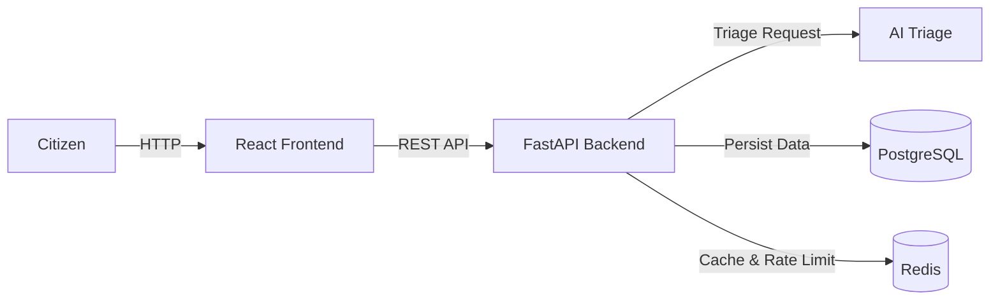

# CivicPulse

 

## Problem Statement
Municipal complaint intake + AI triage platform.

## Architecture


## Quickstart
```bash
cp .env.example .env
docker compose up -d --build
# Wait for services, then:
docker compose exec backend alembic upgrade head
docker compose exec backend python -m scripts.seed
# Frontend: http://localhost:3000
# Backend API: http://localhost:8000/health
```

## API Endpoints (10 required + tracing relay)

| Method | Path | Behaviour / Contract |
|--------|------|----------------------|
| `POST` | `/api/complaints` | Validate → triage → persist. Returns `201 Created`. Field-level `400` validation error body. `429` with `Retry-After` header when rate limited. |
| `GET` | `/api/complaints/{id}` | Get complaint details (`200 OK` or `404 Not Found`). |
| `GET` | `/api/complaints` | Filter by `category`, `priority`, `status`; paginate (`page`, `page_size <= 100`); returns `{items, total, page, page_size}`. |
| `PATCH` | `/api/complaints/{id}/status` | Enforce explicit state machine table. Invalid transition returns `409 Conflict` naming attempted transition. |
| `GET` | `/api/stats` | Aggregates (by category & priority). Redis-cached with 30s TTL, returns `X-Cache: HIT` or `X-Cache: MISS`. Invalidated immediately on complaint creation. |
| `GET` | `/api/meta/providers` | Observability surface: active triage provider and last 20 triage outcomes (provider, latency ms, fallback flag). |
| `GET` | `/health` | Liveness probe for Kubernetes/Docker. Returns `{"status":"ok"}`. Process is alive; strictly does not touch the database. |
| `GET` | `/ready` | Readiness probe. `200 OK` only if PostgreSQL and Redis are both reachable; returns `503 Service Unavailable` naming the failed dependency. |
| `GET` | `/metrics` | Prometheus text exposition format: request count, request latency histogram, triage latency, and fallback counter. |
| `GET` | `/api/meta/config` | Runtime configuration information. |
| `POST` | `/api/telemetry/traces` | *(Bonus: tracing)* Same-origin relay for browser OpenTelemetry spans (OTLP/JSON, ≤ 256 KiB). Returns `204` when tracing is off, `202` once forwarded to the collector. |

## Technology Stack
- **Frontend**: React 18, Vite, TypeScript, Nginx (Alpine multi-stage build)
- **Backend**: FastAPI, Pydantic v2, SQLAlchemy 2 (asyncpg), Alembic
- **AI Triage Layer**: Groq (`llama-3.1-8b-instant`), Ollama (`llama3.2:1b`), Rule-based fallback, Deterministic simulated fake
- **Storage & Caching**: PostgreSQL 16 (persisted via `pgdata`), Redis 7 (AOF persistence, distributed rate limiting, and stats cache)
- **Containerization & Orchestration**: Docker Compose (multi-network, non-root), Kubernetes (Kustomize base & overlays, HPA v2, VPA, PDB)
- **Delivery & Operations**: GitHub Actions (SHA-pinned actions), GHCR, Cosign keyless signing, Argo CD (GitOps), Prometheus, Grafana, OpenTelemetry + Jaeger

## Project Structure

.
├── backend/
├── frontend/
├── k8s/
├── docs/
├── scripts/
├── compose.yaml
├── compose.prod.yaml
└── README.md
```

## Screenshots
*[Placeholder for screenshots of the application interface]*

## Bonus features

| Bonus | How | Evidence |
|---|---|---|
| Zero-downtime rolling update under load | `maxUnavailable: 0`, readiness gate, `preStop` drain; proven by `ops/zero-downtime-demo.ps1` (k6 threshold `http_req_failed rate==0`) | [zero-downtime](docs/evidence/bonus/zero-downtime/) |
| GitOps with Argo CD | CD promotes verified digests to branch `deploy/gitops`; Argo CD syncs `k8s/overlays/gitops` with prune + self-heal ([ADR-0005](docs/adr/0005-gitops-argocd.md)) | [gitops](docs/evidence/bonus/gitops/) |
| Deploy by digest + Cosign | Keyless `cosign sign` in `build-push`, `cosign verify` gate in `deploy-k8s`, `image@sha256:` everywhere ([ADR-0003](docs/adr/0003-deploy-by-sha.md)) | [digest-cosign](docs/evidence/bonus/digest-cosign/) |
| Prometheus + Grafana | `k8s/observability`: pod-discovery scraping of `/metrics`, provisioned "CivicPulse - Backend" dashboard ([ADR-0006](docs/adr/0006-observability-metrics-and-tracing.md)) | [prometheus-grafana](docs/evidence/bonus/prometheus-grafana/) |
| OpenTelemetry frontend → backend → LLM | `traceparent` from the browser, FastAPI + httpx instrumentation, `triage` and `llm.chat_completion` spans, Jaeger | [tracing](docs/evidence/bonus/tracing/) |

Step-by-step demo and evidence capture: **[docs/evidence/bonus/README.md](docs/evidence/bonus/README.md)**.

## Documentation
- [AI Usage](docs/AI-USAGE.md)
- [Triage System](docs/TRIAGE.md)
- [Runbook](docs/RUNBOOK.md)
- [Engineering Notes](docs/ENGINEERING-NOTES.md)
- [Architecture Decision Records (ADRs)](docs/adr/)
- [Evidence](docs/evidence/README.md)
