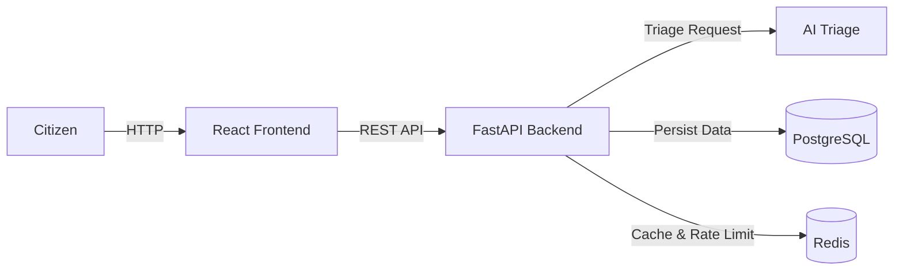

# CivicPulse

 

## Problem Statement
Municipal complaint intake + AI triage platform.

## Architecture


## Quickstart
```bash
cp .env.example .env
docker compose up -d --build
# Wait for services, then:
docker compose exec backend alembic upgrade head
docker compose exec backend python -m scripts.seed
# Frontend: http://localhost:3000
# Backend API: http://localhost:8000/health
```

## API Endpoints

| Method | Path | Description |
|--------|------|-------------|
| GET | `/health` | Health check endpoint |
| GET | `/api/complaints` | List all complaints |
| POST | `/api/complaints` | Submit a new complaint |
| GET | `/api/complaints/{id}` | Get complaint details |

## Technology Stack
- Frontend: React, Vite , wowowooowoowoow
- Backend: FastAPI, Python, SQLAlchemy, Alembic
- AI Triage: Groq (LLM), Ollama, Pydantic
- Database: PostgreSQL
- Caching/Rate Limiting: Redis
- Deployment: Docker, Kubernetes

## Project Structure

.
├── backend/
├── frontend/
├── k8s/
├── docs/
├── scripts/
├── compose.yaml
├── compose.prod.yaml
└── README.md
```

## Screenshots
*[Placeholder for screenshots of the application interface]*

## Documentation
- [AI Usage](docs/AI-USAGE.md)
- [Triage System](docs/TRIAGE.md)
- [Runbook](docs/RUNBOOK.md)
- [Engineering Notes](docs/ENGINEERING-NOTES.md)
- [Architecture Decision Records (ADRs)](docs/adr/)
- [Evidence](docs/evidence/README.md)
